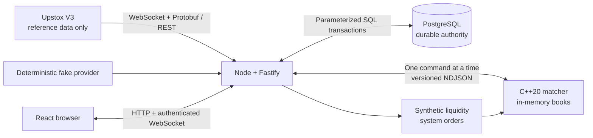

# Architecture

## Purpose and safety boundary

This repository implements an educational paper exchange for a fixed set of NSE cash
instruments. Upstox supplies reference prices only. The application never submits, routes, or
otherwise places a broker or exchange order.

Simulated fills use synthetic liquidity derived from Upstox reference prices; no order is sent to
an exchange.

## Component boundaries

| Component                    | Owns                                                                                                                | Must not own                                                                   |
| ---------------------------- | ------------------------------------------------------------------------------------------------------------------- | ------------------------------------------------------------------------------ |
| React web app                | User interaction and projections of server state                                                                    | Authoritative balances, positions, P&L, or order state                         |
| Node/Fastify API             | Authentication, validation, risk checks, transactions, matcher serialization, provider adapters, and browser events | Matching priority or durable state outside PostgreSQL                          |
| PostgreSQL                   | Durable users, sessions, instruments, watchlists, wallets, ledger, positions, orders, and trades                    | Live matching or market-data subscriptions                                     |
| C++ matcher                  | One single-writer, in-memory price-time-priority book per instrument                                                | Authentication, SQL, portfolio accounting, provider access, or browser sockets |
| Market-data adapter          | Normalization of Upstox or fake data to internal quotes/candles                                                     | Order execution or account decisions                                           |
| Synthetic liquidity provider | Deterministic system orders around a reference price                                                                | Claiming to represent exchange depth or real counterparties                    |

Provider-specific payloads stop at the market-data adapter. The internal live quote has only an
instrument key, integer paise price, exchange timestamp, and receive timestamp.

## Runtime view



## Market-data flow

```text
Upstox authorized WebSocket -> binary Protobuf -> Upstox adapter
  -> MarketTick -> bounded quote cache -> subscribed browser clients
```

Tests and credential-free local development replace the Upstox adapter with a deterministic fake.
Historical candles follow the same provider boundary and are normalized before leaving the API.

## Order flow and commit boundary

```text
HTTP request
  -> authenticate and validate
  -> begin PostgreSQL transaction
  -> lock wallet or position rows
  -> risk-check and reserve cash or shares
  -> insert PENDING order
  -> enqueue exactly one matcher command
  -> receive deterministic matcher events
  -> persist orders, trades, wallet ledger, and positions atomically
  -> commit
  -> publish private WebSocket events
```

No order, trade, wallet, or position event is broadcast before commit. If persistence fails after
the matcher mutates its book, order intake closes and recovery reconstructs the matcher before any
new mutation is accepted.

## Concurrency model

- PostgreSQL row locks serialize competing reservations for the same wallet or position.
- Node sends only one mutating matcher command at a time.
- The matcher is single-writer and assigns monotonically increasing engine sequence numbers.
- Command and client-order idempotency keys prevent retries from applying twice.
- Browser state is a disposable projection that is resynchronized from HTTP after reconnects or
  sequence gaps.

## Recovery

PostgreSQL is the recovery authority. On API startup or matcher failure, Node closes the intake
gate, starts the matcher, sends `RESET`, loads non-terminal LIMIT orders in original engine-sequence
order, sends `REPLAY_ORDER` for each, compares snapshot totals, restores synthetic liquidity, and
opens intake only after reconciliation succeeds. Replay never matches and MARKET orders are never
replayed.

## Deployment shape

The first release is one React app, one Node process, one long-lived C++ child process, and one
PostgreSQL database. Redis, queues, service decomposition, and Kubernetes are intentionally absent.
This keeps ordering, failure handling, and recovery observable.
