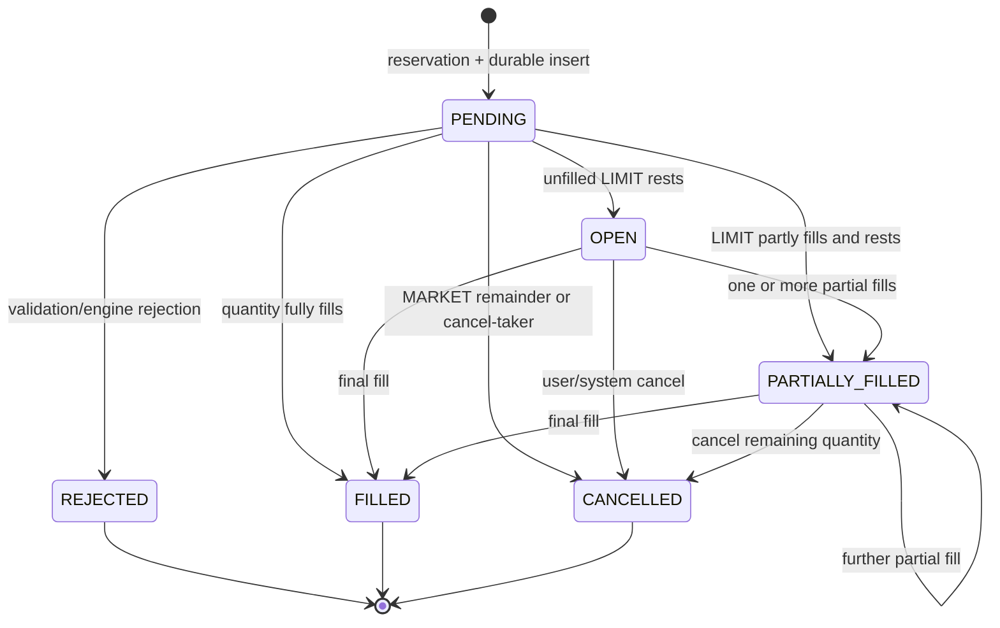

# Trading domain rules

These rules are normative. Code, database constraints, matcher behavior, and tests must agree with
them.

## Numeric representation

- All INR values are signed 64-bit integer paise. Floating-point values are forbidden for prices,
  cash, reservations, cost basis, fees, and P&L.
- Share quantities are positive integers; fractional shares are unsupported.
- Inputs with zero or negative quantity, off-tick LIMIT prices, or arithmetic overflow are rejected.
- Storage timestamps are UTC. API timestamps are ISO 8601; only presentation converts to India time.

## Order vocabulary

An order has side `BUY` or `SELL`, type `MARKET` or `LIMIT`, integer quantity, filled quantity, and
one of these statuses: `PENDING`, `OPEN`, `PARTIALLY_FILLED`, `FILLED`, `CANCELLED`, or `REJECTED`.
A LIMIT order requires `limitPricePaise`; a MARKET order forbids it.

For every order:

```text
0 <= filledQuantity <= quantity
remainingQuantity = quantity - filledQuantity
```

## Matching

- Highest bid and lowest ask have best-price priority. At one price, the lowest engine sequence
  (earliest accepted order) fills first.
- A LIMIT order crosses only prices at or better than its limit. An unfilled remainder rests as
  `OPEN`; a partially filled remainder rests as `PARTIALLY_FILLED`.
- A MARKET order is immediate-or-cancel. It consumes available eligible liquidity and never rests.
  With no fill it becomes `CANCELLED` with zero filled quantity. With a partial fill it becomes
  `CANCELLED` with `0 < filledQuantity < quantity`. A full fill becomes `FILLED`.
- Each execution uses the resting maker order's price, including when a more aggressive LIMIT order
  crosses it.
- Self-trading uses cancel-taker prevention: if the next maker belongs to the taker's participant,
  the incoming remainder is cancelled. The resting maker remains unchanged.
- Every command has a unique `commandId`. Repeating a command returns the recorded result without
  mutating state or producing another fill.

## Order state diagram



Terminal states never reopen. Cancellation is idempotent: a repeated cancellation returns the
existing terminal outcome and releases nothing again. Cancelling a partially filled LIMIT order
preserves its filled quantity, sets `CANCELLED`, and releases exactly the reservation associated
with `quantity - filledQuantity`.

## Risk and reservation

- Short selling, leverage, margin, and fractional quantities are forbidden.
- A BUY reserves cash before matcher entry. A LIMIT BUY initially reserves
  `limitPricePaise * quantity`; fills debit maker-price value and release any price improvement plus
  the cancelled remainder exactly once.
- A MARKET BUY reserves a bounded reference notional plus configured safety buffer. The unused
  amount is released after its immediate result.
- A SELL reserves owned, available shares before matcher entry. Fills consume the reserved shares;
  cancellation releases only the unfilled reserved shares.
- Available and reserved cash/share quantities may never become negative. Concurrent requests lock
  the relevant durable rows so the same resource cannot be reserved twice.
- Every cash mutation has an immutable ledger entry with a reference and unique idempotency key.

## Positions and P&L

BUY fills update a long position using weighted-average cost:

```text
newAveragePaise =
  (oldQuantity * oldAveragePaise + boughtQuantity * buyPricePaise)
  / (oldQuantity + boughtQuantity)
```

The implementation must define and test deterministic integer rounding for any non-integral paise
result. A SELL never changes the average cost of remaining shares. It realizes
`(sellPricePaise - averageCostPaise) * soldQuantity`. Unrealized P&L is derived from a fresh latest
reference quote and is not persisted; a missing or stale quote means unavailable, not zero.

For each fill, bought quantity equals sold quantity. Each trade references both orders and the
engine sequence. Trade, order, wallet, ledger, reservation, and position changes commit atomically.

## Synthetic liquidity

Reference market data is not an executable book. A clearly labelled system participant maintains a
small deterministic ladder around the latest reference price. Old system orders are cancelled
before replacements are added. Configuration controls spread, levels, spacing, quantities, refresh
threshold, and interval. Synthetic liquidity is disabled in deterministic matcher unit tests.

Simulated fills use synthetic liquidity derived from Upstox reference prices; no order is sent to
an exchange.

## Authority and failure semantics

PostgreSQL is the durable source of truth. The C++ process owns only live in-memory books; Node owns
business orchestration; React owns no authoritative account value. After any uncertain boundary
between matcher mutation and database commit, intake becomes unavailable until deterministic replay
from PostgreSQL succeeds. Only committed data is broadcast.
